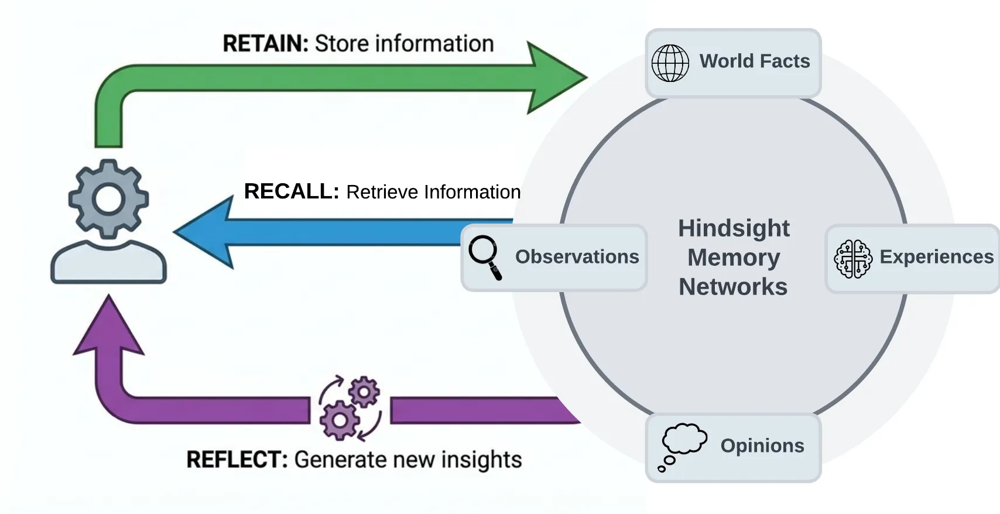

<div align="center">

# Hindsight-CN

**AI 智能体长期记忆系统 · 中文优化版**

[](https://github.com/vectorize-io/hindsight/actions/workflows/release.yml)
[](https://opensource.org/licenses/MIT)

让 AI 拥有像人类一样的工作记忆——不只是记住对话，而是真正**学习**和**成长**。

</div>

---

## 特性

- **中文优化** — 内嵌 `BAAI/bge-small-zh-v1.5` 中文 Embedding + `mmarco-mMiniLMv2` 多语言 Reranker
- **轻量高效** — 模型总占用约 550MB，NAS 等低性能设备也可流畅运行
- **全架构支持** — `linux/arm64` + `linux/amd64` 双架构镜像
- **开箱即用** — 模型内嵌镜像，无需联网下载，离线环境可用
- **Web 管理界面** — 全中文控制面板，可视化管理记忆库
- **自动同步上游** — 定时合并 [vectorize-io/hindsight](https://github.com/vectorize-io/hindsight) 更新

## 快速开始

### 一行命令启动

```bash
docker run --rm -it -p 8888:8888 -p 9999:9999 \
  -e HINDSIGHT_API_LLM_API_KEY=你的API密钥 \
  -e HINDSIGHT_API_LLM_MODEL=MiniMax-M2.7 \
  -e HINDSIGHT_API_LLM_BASE_URL=https://api.minimaxi.com/v1 \
  -v hindsight-data:/home/hindsight/.pg0 \
  transnull/hindsight-cn:latest
```

| 服务 | 地址 |
|------|------|
| API | http://localhost:8888 |
| 管理面板 | http://localhost:9999/dashboard |

### Docker Compose

```bash
git clone https://github.com/vulnnull/hindsight-cn.git
cd hindsight-cn
cp .env.example .env   # 编辑填入 LLM 配置
docker compose up -d
```

### 支持的 LLM 提供商

| 提供商 | provider | 示例模型 |
|--------|----------|---------|
| OpenAI | `openai` | gpt-4o-mini |
| MiniMax | `openai` | MiniMax-M2.7 |
| DeepSeek | `deepseek` | deepseek-v4-flash |
| 智谱 AI | `zai` | glm-4.5-flash |
| Anthropic | `anthropic` | claude-sonnet-4-20250514 |
| Google Gemini | `gemini` | gemini-2.0-flash |
| Ollama / LM Studio | `ollama` | qwen3:8b |
| LiteLLM 代理 | `litellm` | 任意 |

## 记忆类型

Hindsight 模拟人类记忆的工作方式，将信息组织为四种类型：

| 类型 | 说明 | 示例 |
|------|------|------|
| **世界常识** | 普遍知识 | "Python 是 Guido van Rossum 创建的" |
| **经历记忆** | 个人经历 | "用户上周去了北京出差" |
| **观察** | 即时观察 | 从对话中提取的即时信息 |
| **思维模型** | 认知理解 | "用户偏好函数式编程风格" |

所有记忆存储在隔离的**记忆库**（Bank）中，每个智能体拥有独立的"大脑"。

## 使用示例

### Python

```python
from hindsight_client import Hindsight

client = Hindsight(base_url="http://localhost:8888")

# 存储记忆
client.retain(bank_id="agent-1", content="张三在谷歌担任高级工程师，擅长分布式系统")

# 检索记忆
results = client.recall(bank_id="agent-1", query="张三的技术方向是什么？")

# 深度反思
insight = client.reflect(bank_id="agent-1", query="关于张三的职业发展，有什么值得关注的？")
```

### Node.js

```javascript
const { HindsightClient } = require('@vectorize-io/hindsight-client');

const client = new HindsightClient({ baseUrl: 'http://localhost:8888' });

await client.retain('agent-1', '张三最近在学 Rust');
const results = await client.recall('agent-1', '张三在学什么？');
```

### Python 嵌入式（无需独立服务器）

```python
from hindsight import HindsightServer, HindsightClient

with HindsightServer(
    llm_provider="openai",
    llm_model="MiniMax-M2.7",
    llm_api_key="你的API密钥",
    llm_base_url="https://api.minimaxi.com/v1"
) as server:
    client = HindsightClient(base_url=server.url)
    client.retain(bank_id="test", content="测试中文记忆存储")
```

## 中文模型配置

镜像默认内嵌以下轻量中文优化模型，总占用约 **550MB**：

| 组件 | 模型 | 维度 | 大小 | 特点 |
|------|------|------|------|------|
| Embedding | `BAAI/bge-small-zh-v1.5` | 512 | ~100MB | 中文专用，轻量高效 |
| Reranker | `cross-encoder/mmarco-mMiniLMv2-L12-H384-v1` | — | ~450MB | 多语言（含中文），基于 MMARCO 训练 |

### 自定义模型

**构建时替换**（需重新构建镜像）：

```bash
# 英文版
docker build \
  --build-arg EMBEDDING_MODEL="BAAI/bge-small-en-v1.5" \
  --build-arg RERANKER_MODEL="cross-encoder/ms-marco-MiniLM-L-6-v2" \
  -t my-hindsight .

# 高质量中文版（需要更多资源）
docker build \
  --build-arg EMBEDDING_MODEL="BAAI/bge-m3" \
  --build-arg RERANKER_MODEL="BAAI/bge-reranker-v2-m3" \
  -t my-hindsight .
```

**运行时覆盖**（无需重新构建）：

```yaml
environment:
  - HINDSIGHT_API_EMBEDDINGS_PROVIDER=openai         # 改用远程 Embedding
  - HINDSIGHT_API_EMBEDDINGS_OPENAI_MODEL=text-embedding-3-small
  - HINDSIGHT_API_RERANKER_PROVIDER=none             # 关闭 Reranker
```

### 模型选型参考

| Embedding 模型 | 大小 | 维度 | 适用场景 |
|----------------|------|------|---------|
| `BAAI/bge-small-zh-v1.5` | ~100MB | 512 | 中文专用，轻量推荐 |
| `BAAI/bge-m3` | ~560MB | 1024 | 多语言，中文效果最好 |
| `BAAI/bge-small-en-v1.5` | ~80MB | 384 | 英文专用，原版默认 |

| Reranker 模型 | 大小 | 适用场景 |
|---------------|------|---------|
| `cross-encoder/mmarco-mMiniLMv2-L12-H384-v1` | ~450MB | 多语言（含中文），推荐 |
| `BAAI/bge-reranker-v2-m3` | ~568MB | 高质量中文，需要更多资源 |
| `cross-encoder/ms-marco-MiniLM-L-6-v2` | ~80MB | 英文专用，原版默认 |

## 架构



### 三大核心操作

**Retain（存储）** — 存入信息，LLM 自动提取事实、实体和关系

**Recall（检索）** — 四路并行搜索（语义 + 关键词 + 图谱 + 时间），经重排序后返回最相关结果

**Reflect（反思）** — 基于记忆库生成带情境感知的深度分析

---

## 与原版的区别

| 特性 | 原版 (vectorize-io) | 中文版 (vulnnull) |
|------|--------------------|--------------------|
| UI 语言 | 英文 | 中文 |
| Embedding | `bge-small-en-v1.5`（英文，384维） | `bge-small-zh-v1.5`（中文，512维） |
| Reranker | `ms-marco-MiniLM-L-6-v2`（英文） | `mmarco-mMiniLMv2`（多语言含中文） |
| 模型总大小 | ~160MB | ~550MB |
| 镜像架构 | amd64 | arm64 + amd64 |
| LLM 适配 | OpenAI 为主 | 额外支持 MiniMax、DeepSeek、智谱 |
| HuggingFace | 默认源 | 支持 `hf-mirror.com` 镜像 |

## 上游同步

本仓库通过 GitHub Actions 每日自动同步 [vectorize-io/hindsight](https://github.com/vectorize-io/hindsight) 上游更新，同时保留所有中文汉化内容。合并冲突时自动优先使用本地版本。

## 资源

- [官方文档](https://hindsight.vectorize.io)
- [论文](https://arxiv.org/abs/2512.12818)
- [Python SDK](http://hindsight.vectorize.io/sdks/python) · [Node.js SDK](http://hindsight.vectorize.io/sdks/nodejs) · [CLI](https://hindsight.vectorize.io/sdks/cli)
- [Slack 社区](https://join.slack.com/t/hindsight-space/shared_invite/zt-3nhbm4w29-LeSJ5Ixi6j8PdiYOCPlOgg)

## 贡献

欢迎提交 Issue 和 Pull Request。详见 [贡献指南](./CONTRIBUTING.md)。

## 许可证

MIT 协议 — 参见 [LICENSE](./LICENSE)

---

原版由 [Vectorize.io](https://vectorize.io) 构建 · 中文版由 [vulnnull](https://github.com/vulnnull) 维护
