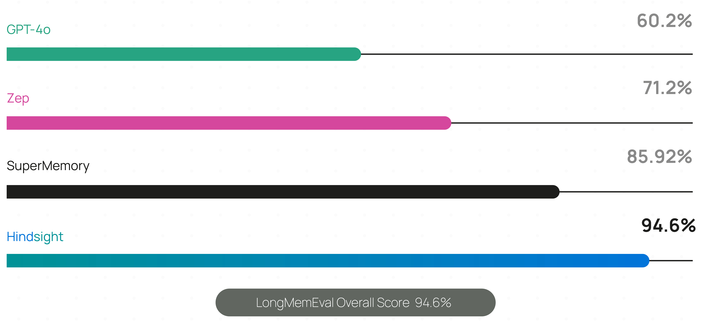
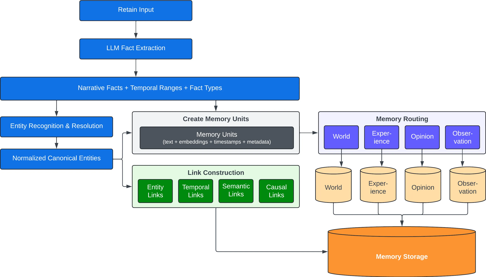
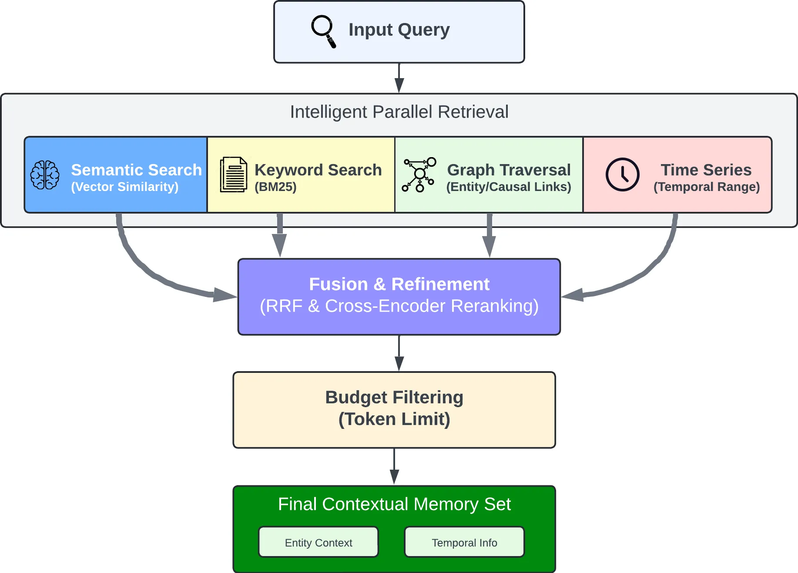
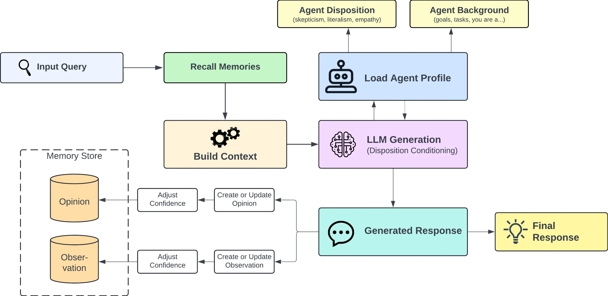

<div align="center">


[官方文档](https://hindsight.vectorize.io) · [论文](https://arxiv.org/abs/2512.12818) · [示例手册](https://hindsight.vectorize.io/cookbook)

[](https://github.com/vectorize-io/hindsight/actions/workflows/release.yml)
[](https://join.slack.com/t/hindsight-space/shared_invite/zt-3nhbm4w29-LeSJ5Ixi6j8PdiYOCPlOgg)
[](https://opensource.org/licenses/MIT)


</div>

---

## 什么是 Hindsight？

**Hindsight-CN** 是 [Hindsight](https://github.com/vectorize-io/hindsight) 的中文汉化版本。Hindsight™ 是一款 AI 代理记忆系统，旨在让智能体在时间推移中不断学习成长。与大多数仅关注对话历史回忆的记忆系统不同，Hindsight 专注于让智能体真正**学习**——而不仅仅是**记住**。

<video src="https://github.com/user-attachments/assets/923b798d-3581-4897-bb62-9cfa5a931682" controls></video>

它克服了 RAG（检索增强生成）和知识图谱等传统技术的局限性，在长期记忆任务上取得了业界领先的性能。

## 记忆性能与准确率

根据基准测试结果，Hindsight 是迄今为止经过测试的最准确的 AI 代理记忆系统。它在 LongMemEval 基准测试中取得了业界领先的成绩，该基准广泛用于评估各种对话式 AI 场景下记忆系统的性能。以下展示 Hindsight 与其他代理记忆解决方案截至 2026 年 1 月的报告性能：



Hindsight 的基准测试数据已由弗吉尼亚理工大学 [Sanghani 人工智能与数据分析中心](https://sanghani.cs.vt.edu/) 和《华盛顿邮报》的研究合作者独立复现。其他厂商的分数由其自行报告。

Hindsight 已部署于财富 500 强企业的生产环境，并被越来越多的 AI 创业公司采用。

## 核心概念（中文本地化）

Hindsight 采用生物拟态数据结构组织代理记忆，模拟人类记忆的工作方式：

| 英文原称 | 中文译名 | 含义 |
|---------|---------|------|
| **World** | **世界常识** | 关于世界的普遍知识（"炉子很烫"） |
| **Experience** | **经历记忆** | 智能体自身的经历（"我摸了炉子，真的很疼"） |
| **Observation** | **观察** | 从记忆中提炼的即时观察 |
| **Mental Model** | **思维模型** | 通过反思原始记忆和经历形成的认知理解 |
| **Bank** | **记忆库** | 存储隔离的记忆空间（每个智能体一个"大脑"） |

## 快速开始

### Docker（推荐）

镜像内嵌 `BAAI/bge-m3`（多语言 Embedding）和 `BAAI/bge-reranker-v2-m3`（多语言 Reranker），原生支持中文语义检索，无需额外配置。

```bash
export HINDSIGHT_API_LLM_API_KEY=你的API密钥

docker run --rm -it -p 8888:8888 -p 9999:9999 \
  -e HINDSIGHT_API_LLM_API_KEY=$HINDSIGHT_API_LLM_API_KEY \
  -e HINDSIGHT_API_LLM_MODEL=gpt-4o-mini \
  -e HINDSIGHT_API_LLM_BASE_URL=https://api.openai.com/v1 \
  -v $HOME/.hindsight-cn:/home/hindsight/.pg0 \
  transnull/hindsight-cn:latest
```

> API 地址: http://localhost:8888
> Web 管理界面: http://localhost:9999/dashboard

### Docker Compose

```bash
# 克隆本仓库
git clone https://github.com/vulnnull/hindsight-cn.git
cd hindsight-cn

# 编辑 .env 文件，填入 LLM 配置
cp .env.example .env
# HINDSIGHT_API_LLM_API_KEY=你的API密钥

# 启动服务
docker compose up -d
```

### 客户端 SDK

```bash
pip install hindsight-client -U
# 或
npm install @vectorize-io/hindsight-client
```

#### Python

```python
from hindsight_client import Hindsight

client = Hindsight(base_url="http://localhost:8888")

# 记忆存储（Retain）：存入信息
client.retain(bank_id="my-bank", content="张三在谷歌担任软件工程师")

# 记忆召回（Recall）：搜索记忆
client.recall(bank_id="my-bank", query="张三的工作是什么？")

# 深度反思（Reflect）：基于记忆生成带情境感知的回复
client.reflect(bank_id="my-bank", query="介绍一下张三")
```

#### Node.js / TypeScript

```bash
npm install @vectorize-io/hindsight-client
```

```javascript
const { HindsightClient } = require('@vectorize-io/hindsight-client');

const main = async () => {
  const client = new HindsightClient({ baseUrl: 'http://localhost:8888' });

  await client.retain('my-bank', '张三喜欢在优胜美地徒步');

  const results = await client.recall('my-bank', '张三喜欢什么？');
  console.log(results);
};

main();
```

### Python 嵌入式模式（无需独立服务器）

```bash
pip install hindsight-all -U
```

```python
import os
from hindsight import HindsightServer, HindsightClient

with HindsightServer(
    llm_provider="openai",
    llm_model="gpt-5-mini",
    llm_api_key=os.environ["OPENAI_API_KEY"]
) as server:
    client = HindsightClient(base_url=server.url)
    client.retain(bank_id="my-bank", content="张三在谷歌工作")
    results = client.recall(bank_id="my-bank", query="张三在哪里工作？")
```

---

## 中文模型适配

本镜像相比原版做了以下中文优化：

| 组件 | 原版（英文优化） | CN 版（中文优化） |
|------|----------------|-----------------|
| **Embedding 模型** | `BAAI/bge-small-en-v1.5`（384维） | `BAAI/bge-m3`（1024维，多语言） |
| **Reranker 模型** | `cross-encoder/ms-marco-MiniLM-L-6-v2` | `BAAI/bge-reranker-v2-m3`（多语言） |
| **镜像架构** | linux/amd64 | linux/arm64 + linux/amd64 |
| **离线运行** | 需首次联网下载模型 | 模型内嵌，开箱即用 |

### 自定义模型

构建时可替换为其他模型：

```bash
docker build \
  --build-arg EMBEDDING_MODEL="BAAI/bge-small-zh-v1.5" \
  --build-arg RERANKER_MODEL="BAAI/bge-reranker-v2-m3" \
  -f docker/standalone/Dockerfile \
  -t my-hindsight-cn .
```

运行时也可通过环境变量覆盖（不重新构建）：

```yaml
environment:
  - HINDSIGHT_API_EMBEDDINGS_LOCAL_MODEL=BAAI/bge-m3
  - HINDSIGHT_API_RERANKER_LOCAL_MODEL=BAAI/bge-reranker-v2-m3
```

---

## 架构与操作


Hindsight 提供三个核心操作与系统交互：

### 记忆存储（Retain）

`retain` 操作用于将新记忆存入 Hindsight。

```python
from hindsight_client import Hindsight

client = Hindsight(base_url="http://localhost:8888")

# 简单存储
client.retain(
    bank_id="my-bank",
    content="张三在谷歌担任软件工程师"
)

# 带上下文和时间戳
client.retain(
    bank_id="my-bank",
    content="张三晋升为高级工程师",
    context="职业更新",
    timestamp="2025-06-15T10:00:00Z"
)
```

在后台，retain 操作利用 LLM 提取关键事实、时间数据、实体和关系，经过归一化处理后转换为规范化实体、时间序列和搜索索引。



### 记忆召回（Recall）

`recall` 操作用于检索记忆，支持从所有记忆类型中查询。

```python
from hindsight_client import Hindsight

client = Hindsight(base_url="http://localhost:8888")

# 简单召回
client.recall(bank_id="my-bank", query="张三的工作是什么？")

# 时间范围召回
client.recall(bank_id="my-bank", query="六月发生了什么？")
```

召回操作并行执行 4 种检索策略：

- **语义检索**：向量相似度匹配
- **关键词检索**：BM25 精确匹配
- **图谱检索**：实体/时间/因果关联
- **时间检索**：时间范围过滤

各检索结果经互惠排名融合（RRF）和交叉编码器重排序后输出。



### 深度反思（Reflect）

`reflect` 操作用于对已有记忆进行更深入的分析，帮助智能体建立记忆之间的新连接，构建更全面的认知理解。

```python
from hindsight_client import Hindsight

client = Hindsight(base_url="http://localhost:8888")

client.reflect(bank_id="my-bank", query="关于张三我需要了解什么？")
```



---

## 使用场景

- **AI 项目经理**：反思项目中需要规避的风险
- **销售智能体**：分析哪些推广信息获得了回复及原因
- **客服智能体**：发现客户提出的、现有文档未能覆盖的问题
- **个性化聊天**：为每个用户存储和召回个性化记忆

---

## 上游同步

本仓库通过 GitHub Actions 定时同步 [vectorize-io/hindsight](https://github.com/vectorize-io/hindsight) 上游更新，同时保留中文汉化内容。遇冲突时自动优先使用本地汉化版本。

---

## 资源

**官方文档：**
- [https://hindsight.vectorize.io](https://hindsight.vectorize.io)

**客户端：**
- [Python SDK](http://hindsight.vectorize.io/sdks/python)
- [Node.js SDK](http://hindsight.vectorize.io/sdks/nodejs)
- [REST API](https://hindsight.vectorize.io/api-reference)
- [CLI](https://hindsight.vectorize.io/sdks/cli)

**社区：**
- [Slack](https://join.slack.com/t/hindsight-space/shared_invite/zt-3nhbm4w29-LeSJ5Ixi6j8PdiYOCPlOgg)
- [GitHub Issues](https://github.com/vectorize-io/hindsight/issues)

---

## Star 历史

[](https://www.star-history.com/#vectorize-io/hindsight&type=date&legend=top-left)

---

## 贡献

欢迎提交 Issue 和 Pull Request。

## 许可证

MIT 协议 — 参见 [LICENSE](./LICENSE)

---

原版由 [Vectorize.io](https://vectorize.io) 构建 · 中文汉化版由 [vulnnull](https://github.com/vulnnull) 维护


